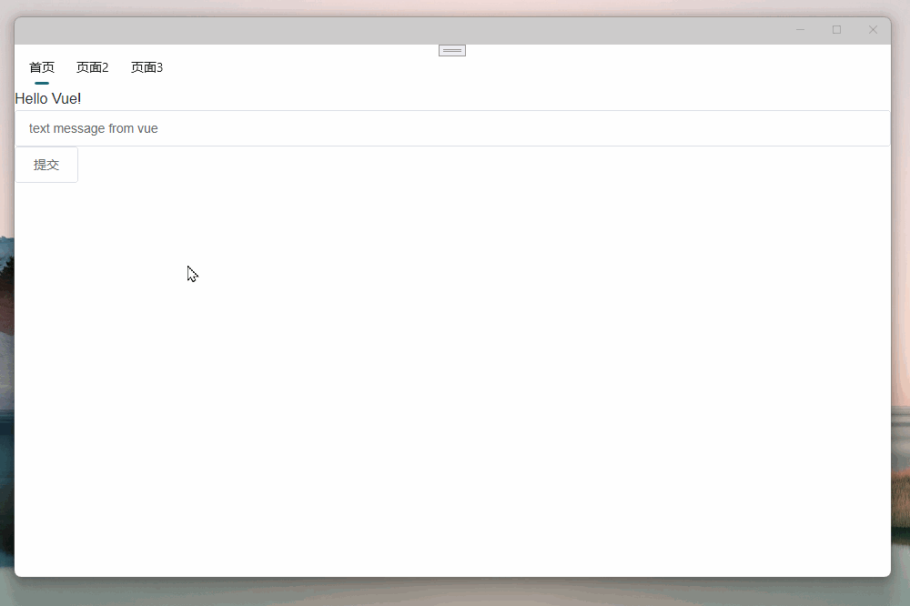

# maui-vue-hybirddev

使用.NET MAUI Blazor 与 Vue.js 开发跨平台应用

## MAUI-Vue-Hybriddev-StandaloneHost 

使用Vue.Cli创建独立的Vue项目
在Vue项目中使用Node.js和Webpack构建技术
发布Vue到静态文件
创建一个.NET MAUI Blazor项目，使用项目的dist目录拷贝到.NET MAUI Blazor项目的wwwroot目录下
在.NET MAUI Blazor项目中使用Blazor的组件引用Vue.js项目的index.html文件，从而实现.NET MAUI Blazor与Vue.js的混合开发。

博文：https://blog.csdn.net/jevonsflash/article/details/121833749

## MAUI-Vue-Hybriddev-Integrated

与Blazor MAUI App项目集成，将Vue作为MAUI的一部分，直接在MAUI项目中直接使用vue。
不使用Vue Router、Vuex、Vue CLI、单文件组件
仅使用Vue的模板语法，事件处理，计算属性/侦听器等基础特性

博文：https://blog.csdn.net/jevonsflash/article/details/133910124

